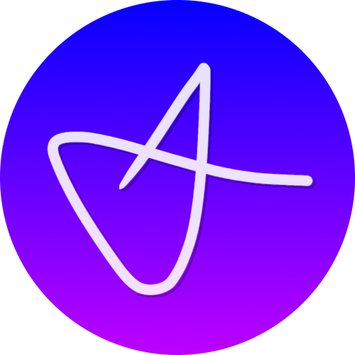

  

<h1 align="center">Hi there </h1>

  <b>Welcome to my GitHub profile!</b>

---

<h2 align="center">🛠️ Tools I Use</h2>

<table align="center">
  <tr>
    <td align="center" width="120">
       
      <b>VS Code</b>
    </td>
    <td align="center" width="120">
       
      <b>IntelliJ IDEA</b>
    </td>
    <td align="center" width="120">
       
      <b>Photoshop</b>
    </td>
    <td align="center" width="120">
       
      <b>Blender</b>
    </td>
    <td align="center" width="120">
       
      <b>DaVinci Resolve</b>
    </td>
  </tr>
</table>

<h3 align="center">📌 More Tools</h3>

| Category | Tools |
|:--------:|:------|
| 💻 **IDEs** | Visual Studio Code, IntelliJ IDEA |
| 🎨 **Graphics** | Affinity Suite, Adobe Photoshop |
| 🧊 **3D & CAD** | Blender, Autodesk Fusion |
| 🎬 **Video** | After Effects, DaVinci Resolve |

---

<h2 align="center">🌐 Connect with Me</h2>

  📫 <a href="https://arekmas.pl"><b>arekmas.pl</b></a> &nbsp;|&nbsp; <a href="mailto:kontakt@arekmas.pl"><b>kontakt@arekmas.pl</b></a>

  <a href="https://x.com/">https://x.com/arekmas1</a>&nbsp;
  <a href="https://youtube.com/">https://www.youtube.com/@arekmas</a>&nbsp;
  <a href="https://discord.com/">https://discord.com/users/506063417640222720</a>&nbsp;
  <a href="https://instagram.com/">https://discord.com/users/506063417640222720</a>

---

  Made with ❤️

